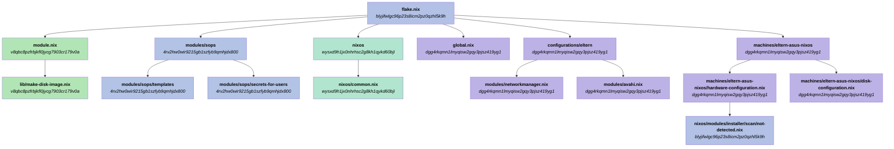
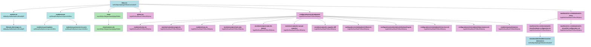
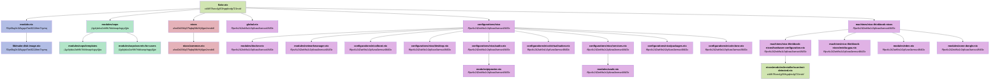
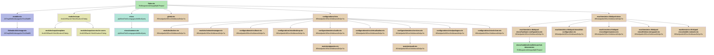
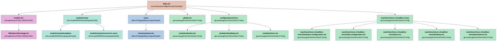
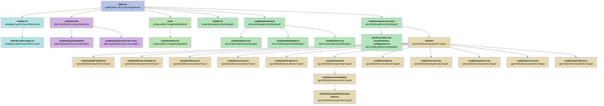

# NixOS Configuration Graphs

## eltern-asus-nixos

```mermaid
flowchart TD
    nblyjifwlgc96p23s8icm2pz0qzhl5k9h_flake_nix["`**flake.nix**

_blyjifwlgc96p23s8icm2pz0qzhl5k9h_`"]
    nv8qbc8pzfrbjkfl0jycg7903cr179v0a_module_nix["`**module.nix**

_v8qbc8pzfrbjkfl0jycg7903cr179v0a_`"]
    nv8qbc8pzfrbjkfl0jycg7903cr179v0a_lib_make_disk_image_nix["`**lib/make-disk-image.nix**

_v8qbc8pzfrbjkfl0jycg7903cr179v0a_`"]
    n4rv2hw0wir9215gb1szfyb9qmhjdx800_modules_sops["`**modules/sops**

_4rv2hw0wir9215gb1szfyb9qmhjdx800_`"]
    n4rv2hw0wir9215gb1szfyb9qmhjdx800_modules_sops_templates["`**modules/sops/templates**

_4rv2hw0wir9215gb1szfyb9qmhjdx800_`"]
    n4rv2hw0wir9215gb1szfyb9qmhjdx800_modules_sops_secrets_for_users["`**modules/sops/secrets-for-users**

_4rv2hw0wir9215gb1szfyb9qmhjdx800_`"]
    nwysxd9h1jx0nhrhsc2g8kh1qykd60bjl_nixos["`**nixos**

_wysxd9h1jx0nhrhsc2g8kh1qykd60bjl_`"]
    nwysxd9h1jx0nhrhsc2g8kh1qykd60bjl_nixos_common_nix["`**nixos/common.nix**

_wysxd9h1jx0nhrhsc2g8kh1qykd60bjl_`"]
    ndgg4rkqmn1lmyqisw2gqy3pjsz419yg1_global_nix["`**global.nix**

_dgg4rkqmn1lmyqisw2gqy3pjsz419yg1_`"]
    ndgg4rkqmn1lmyqisw2gqy3pjsz419yg1_configurations_eltern["`**configurations/eltern**

_dgg4rkqmn1lmyqisw2gqy3pjsz419yg1_`"]
    ndgg4rkqmn1lmyqisw2gqy3pjsz419yg1_modules_networkmanager_nix["`**modules/networkmanager.nix**

_dgg4rkqmn1lmyqisw2gqy3pjsz419yg1_`"]
    ndgg4rkqmn1lmyqisw2gqy3pjsz419yg1_modules_avahi_nix["`**modules/avahi.nix**

_dgg4rkqmn1lmyqisw2gqy3pjsz419yg1_`"]
    ndgg4rkqmn1lmyqisw2gqy3pjsz419yg1_machines_eltern_asus_nixos["`**machines/eltern-asus-nixos**

_dgg4rkqmn1lmyqisw2gqy3pjsz419yg1_`"]
    ndgg4rkqmn1lmyqisw2gqy3pjsz419yg1_machines_eltern_asus_nixos_hardware_configuration_nix["`**machines/eltern-asus-nixos/hardware-configuration.nix**

_dgg4rkqmn1lmyqisw2gqy3pjsz419yg1_`"]
    nblyjifwlgc96p23s8icm2pz0qzhl5k9h_nixos_modules_installer_scan_not_detected_nix["`**nixos/modules/installer/scan/not-detected.nix**

_blyjifwlgc96p23s8icm2pz0qzhl5k9h_`"]
    ndgg4rkqmn1lmyqisw2gqy3pjsz419yg1_machines_eltern_asus_nixos_disk_configuration_nix["`**machines/eltern-asus-nixos/disk-configuration.nix**

_dgg4rkqmn1lmyqisw2gqy3pjsz419yg1_`"]
    nblyjifwlgc96p23s8icm2pz0qzhl5k9h_flake_nix --> nv8qbc8pzfrbjkfl0jycg7903cr179v0a_module_nix
    nblyjifwlgc96p23s8icm2pz0qzhl5k9h_flake_nix --> n4rv2hw0wir9215gb1szfyb9qmhjdx800_modules_sops
    nblyjifwlgc96p23s8icm2pz0qzhl5k9h_flake_nix --> nwysxd9h1jx0nhrhsc2g8kh1qykd60bjl_nixos
    nblyjifwlgc96p23s8icm2pz0qzhl5k9h_flake_nix --> ndgg4rkqmn1lmyqisw2gqy3pjsz419yg1_global_nix
    nblyjifwlgc96p23s8icm2pz0qzhl5k9h_flake_nix --> ndgg4rkqmn1lmyqisw2gqy3pjsz419yg1_configurations_eltern
    nblyjifwlgc96p23s8icm2pz0qzhl5k9h_flake_nix --> ndgg4rkqmn1lmyqisw2gqy3pjsz419yg1_machines_eltern_asus_nixos
    nv8qbc8pzfrbjkfl0jycg7903cr179v0a_module_nix --> nv8qbc8pzfrbjkfl0jycg7903cr179v0a_lib_make_disk_image_nix
    n4rv2hw0wir9215gb1szfyb9qmhjdx800_modules_sops --> n4rv2hw0wir9215gb1szfyb9qmhjdx800_modules_sops_templates
    n4rv2hw0wir9215gb1szfyb9qmhjdx800_modules_sops --> n4rv2hw0wir9215gb1szfyb9qmhjdx800_modules_sops_secrets_for_users
    nwysxd9h1jx0nhrhsc2g8kh1qykd60bjl_nixos --> nwysxd9h1jx0nhrhsc2g8kh1qykd60bjl_nixos_common_nix
    ndgg4rkqmn1lmyqisw2gqy3pjsz419yg1_configurations_eltern --> ndgg4rkqmn1lmyqisw2gqy3pjsz419yg1_modules_networkmanager_nix
    ndgg4rkqmn1lmyqisw2gqy3pjsz419yg1_configurations_eltern --> ndgg4rkqmn1lmyqisw2gqy3pjsz419yg1_modules_avahi_nix
    ndgg4rkqmn1lmyqisw2gqy3pjsz419yg1_machines_eltern_asus_nixos --> ndgg4rkqmn1lmyqisw2gqy3pjsz419yg1_machines_eltern_asus_nixos_hardware_configuration_nix
    ndgg4rkqmn1lmyqisw2gqy3pjsz419yg1_machines_eltern_asus_nixos --> ndgg4rkqmn1lmyqisw2gqy3pjsz419yg1_machines_eltern_asus_nixos_disk_configuration_nix
    ndgg4rkqmn1lmyqisw2gqy3pjsz419yg1_machines_eltern_asus_nixos_hardware_configuration_nix --> nblyjifwlgc96p23s8icm2pz0qzhl5k9h_nixos_modules_installer_scan_not_detected_nix
    style nblyjifwlgc96p23s8icm2pz0qzhl5k9h_flake_nix fill:#b2c1e5,color:#000000
    style nv8qbc8pzfrbjkfl0jycg7903cr179v0a_module_nix fill:#b2e5b6,color:#000000
    style nv8qbc8pzfrbjkfl0jycg7903cr179v0a_lib_make_disk_image_nix fill:#b2e5b6,color:#000000
    style n4rv2hw0wir9215gb1szfyb9qmhjdx800_modules_sops fill:#b2c3e5,color:#000000
    style n4rv2hw0wir9215gb1szfyb9qmhjdx800_modules_sops_templates fill:#b2c3e5,color:#000000
    style n4rv2hw0wir9215gb1szfyb9qmhjdx800_modules_sops_secrets_for_users fill:#b2c3e5,color:#000000
    style nwysxd9h1jx0nhrhsc2g8kh1qykd60bjl_nixos fill:#b2e5cf,color:#000000
    style nwysxd9h1jx0nhrhsc2g8kh1qykd60bjl_nixos_common_nix fill:#b2e5cf,color:#000000
    style ndgg4rkqmn1lmyqisw2gqy3pjsz419yg1_global_nix fill:#bdb2e5,color:#000000
    style ndgg4rkqmn1lmyqisw2gqy3pjsz419yg1_configurations_eltern fill:#bdb2e5,color:#000000
    style ndgg4rkqmn1lmyqisw2gqy3pjsz419yg1_modules_networkmanager_nix fill:#bdb2e5,color:#000000
    style ndgg4rkqmn1lmyqisw2gqy3pjsz419yg1_modules_avahi_nix fill:#bdb2e5,color:#000000
    style ndgg4rkqmn1lmyqisw2gqy3pjsz419yg1_machines_eltern_asus_nixos fill:#bdb2e5,color:#000000
    style ndgg4rkqmn1lmyqisw2gqy3pjsz419yg1_machines_eltern_asus_nixos_hardware_configuration_nix fill:#bdb2e5,color:#000000
    style nblyjifwlgc96p23s8icm2pz0qzhl5k9h_nixos_modules_installer_scan_not_detected_nix fill:#b2c1e5,color:#000000
    style ndgg4rkqmn1lmyqisw2gqy3pjsz419yg1_machines_eltern_asus_nixos_disk_configuration_nix fill:#bdb2e5,color:#000000
```

## nico-schokoladenelch-nixos

```mermaid
flowchart TD
    n0c81494pm8q9axg9789xb01m31afa3l7_flake_nix["`**flake.nix**

_0c81494pm8q9axg9789xb01m31afa3l7_`"]
    n4bljbq3yy2wl9brfnab8vs0lfmz8dj25_module_nix["`**module.nix**

_4bljbq3yy2wl9brfnab8vs0lfmz8dj25_`"]
    n4bljbq3yy2wl9brfnab8vs0lfmz8dj25_lib_make_disk_image_nix["`**lib/make-disk-image.nix**

_4bljbq3yy2wl9brfnab8vs0lfmz8dj25_`"]
    nny994wq50x88y3ws2srlspivc8nh8fmc_modules_sops["`**modules/sops**

_ny994wq50x88y3ws2srlspivc8nh8fmc_`"]
    nny994wq50x88y3ws2srlspivc8nh8fmc_modules_sops_templates["`**modules/sops/templates**

_ny994wq50x88y3ws2srlspivc8nh8fmc_`"]
    nny994wq50x88y3ws2srlspivc8nh8fmc_modules_sops_secrets_for_users["`**modules/sops/secrets-for-users**

_ny994wq50x88y3ws2srlspivc8nh8fmc_`"]
    nmjcx0kk9yx6h4igam3aamfg2qp264dhd_nixos["`**nixos**

_mjcx0kk9yx6h4igam3aamfg2qp264dhd_`"]
    nmjcx0kk9yx6h4igam3aamfg2qp264dhd_nixos_common_nix["`**nixos/common.nix**

_mjcx0kk9yx6h4igam3aamfg2qp264dhd_`"]
    nhxgfxf0x0hsw5hwi67039xz391fyinrq_global_nix["`**global.nix**

_hxgfxf0x0hsw5hwi67039xz391fyinrq_`"]
    nhxgfxf0x0hsw5hwi67039xz391fyinrq_configurations_schokoladenelch["`**configurations/schokoladenelch**

_hxgfxf0x0hsw5hwi67039xz391fyinrq_`"]
    nhxgfxf0x0hsw5hwi67039xz391fyinrq_modules_docker_nix["`**modules/docker.nix**

_hxgfxf0x0hsw5hwi67039xz391fyinrq_`"]
    nhxgfxf0x0hsw5hwi67039xz391fyinrq_modules_networkmanager_nix["`**modules/networkmanager.nix**

_hxgfxf0x0hsw5hwi67039xz391fyinrq_`"]
    nhxgfxf0x0hsw5hwi67039xz391fyinrq_modules_tmux_nix["`**modules/tmux.nix**

_hxgfxf0x0hsw5hwi67039xz391fyinrq_`"]
    nhxgfxf0x0hsw5hwi67039xz391fyinrq_modules_scripts_check_mkv["`**modules/scripts/check-mkv**

_hxgfxf0x0hsw5hwi67039xz391fyinrq_`"]
    nhxgfxf0x0hsw5hwi67039xz391fyinrq_modules_scripts_create_zfs_dataset["`**modules/scripts/create-zfs-dataset**

_hxgfxf0x0hsw5hwi67039xz391fyinrq_`"]
    nhxgfxf0x0hsw5hwi67039xz391fyinrq_modules_scripts_zfs_manual_snapshot["`**modules/scripts/zfs-manual-snapshot**

_hxgfxf0x0hsw5hwi67039xz391fyinrq_`"]
    nhxgfxf0x0hsw5hwi67039xz391fyinrq_modules_scripts_zfs_snapshot_diff["`**modules/scripts/zfs-snapshot-diff**

_hxgfxf0x0hsw5hwi67039xz391fyinrq_`"]
    nhxgfxf0x0hsw5hwi67039xz391fyinrq_configurations_schokoladenelch_boot_nix["`**configurations/schokoladenelch/boot.nix**

_hxgfxf0x0hsw5hwi67039xz391fyinrq_`"]
    nhxgfxf0x0hsw5hwi67039xz391fyinrq_configurations_schokoladenelch_networking_nix["`**configurations/schokoladenelch/networking.nix**

_hxgfxf0x0hsw5hwi67039xz391fyinrq_`"]
    nhxgfxf0x0hsw5hwi67039xz391fyinrq_configurations_schokoladenelch_services_nix["`**configurations/schokoladenelch/services.nix**

_hxgfxf0x0hsw5hwi67039xz391fyinrq_`"]
    nhxgfxf0x0hsw5hwi67039xz391fyinrq_configurations_schokoladenelch_persistence_nix["`**configurations/schokoladenelch/persistence.nix**

_hxgfxf0x0hsw5hwi67039xz391fyinrq_`"]
    nhxgfxf0x0hsw5hwi67039xz391fyinrq_modules_stacks_default_nix["`**modules/stacks/default.nix**

_hxgfxf0x0hsw5hwi67039xz391fyinrq_`"]
    nhxgfxf0x0hsw5hwi67039xz391fyinrq_machines_nico_schokoladenelch_nixos["`**machines/nico-schokoladenelch-nixos**

_hxgfxf0x0hsw5hwi67039xz391fyinrq_`"]
    nhxgfxf0x0hsw5hwi67039xz391fyinrq_machines_nico_schokoladenelch_nixos_hardware_configuration_nix["`**machines/nico-schokoladenelch-nixos/hardware-configuration.nix**

_hxgfxf0x0hsw5hwi67039xz391fyinrq_`"]
    n0c81494pm8q9axg9789xb01m31afa3l7_nixos_modules_installer_scan_not_detected_nix["`**nixos/modules/installer/scan/not-detected.nix**

_0c81494pm8q9axg9789xb01m31afa3l7_`"]
    nhxgfxf0x0hsw5hwi67039xz391fyinrq_machines_nico_schokoladenelch_nixos_disk_configuration_nix["`**machines/nico-schokoladenelch-nixos/disk-configuration.nix**

_hxgfxf0x0hsw5hwi67039xz391fyinrq_`"]
    n0c81494pm8q9axg9789xb01m31afa3l7_flake_nix --> n4bljbq3yy2wl9brfnab8vs0lfmz8dj25_module_nix
    n0c81494pm8q9axg9789xb01m31afa3l7_flake_nix --> nny994wq50x88y3ws2srlspivc8nh8fmc_modules_sops
    n0c81494pm8q9axg9789xb01m31afa3l7_flake_nix --> nmjcx0kk9yx6h4igam3aamfg2qp264dhd_nixos
    n0c81494pm8q9axg9789xb01m31afa3l7_flake_nix --> nhxgfxf0x0hsw5hwi67039xz391fyinrq_global_nix
    n0c81494pm8q9axg9789xb01m31afa3l7_flake_nix --> nhxgfxf0x0hsw5hwi67039xz391fyinrq_configurations_schokoladenelch
    n0c81494pm8q9axg9789xb01m31afa3l7_flake_nix --> nhxgfxf0x0hsw5hwi67039xz391fyinrq_machines_nico_schokoladenelch_nixos
    n4bljbq3yy2wl9brfnab8vs0lfmz8dj25_module_nix --> n4bljbq3yy2wl9brfnab8vs0lfmz8dj25_lib_make_disk_image_nix
    nny994wq50x88y3ws2srlspivc8nh8fmc_modules_sops --> nny994wq50x88y3ws2srlspivc8nh8fmc_modules_sops_templates
    nny994wq50x88y3ws2srlspivc8nh8fmc_modules_sops --> nny994wq50x88y3ws2srlspivc8nh8fmc_modules_sops_secrets_for_users
    nmjcx0kk9yx6h4igam3aamfg2qp264dhd_nixos --> nmjcx0kk9yx6h4igam3aamfg2qp264dhd_nixos_common_nix
    nhxgfxf0x0hsw5hwi67039xz391fyinrq_configurations_schokoladenelch --> nhxgfxf0x0hsw5hwi67039xz391fyinrq_modules_docker_nix
    nhxgfxf0x0hsw5hwi67039xz391fyinrq_configurations_schokoladenelch --> nhxgfxf0x0hsw5hwi67039xz391fyinrq_modules_networkmanager_nix
    nhxgfxf0x0hsw5hwi67039xz391fyinrq_configurations_schokoladenelch --> nhxgfxf0x0hsw5hwi67039xz391fyinrq_modules_tmux_nix
    nhxgfxf0x0hsw5hwi67039xz391fyinrq_configurations_schokoladenelch --> nhxgfxf0x0hsw5hwi67039xz391fyinrq_modules_scripts_check_mkv
    nhxgfxf0x0hsw5hwi67039xz391fyinrq_configurations_schokoladenelch --> nhxgfxf0x0hsw5hwi67039xz391fyinrq_modules_scripts_create_zfs_dataset
    nhxgfxf0x0hsw5hwi67039xz391fyinrq_configurations_schokoladenelch --> nhxgfxf0x0hsw5hwi67039xz391fyinrq_modules_scripts_zfs_manual_snapshot
    nhxgfxf0x0hsw5hwi67039xz391fyinrq_configurations_schokoladenelch --> nhxgfxf0x0hsw5hwi67039xz391fyinrq_modules_scripts_zfs_snapshot_diff
    nhxgfxf0x0hsw5hwi67039xz391fyinrq_configurations_schokoladenelch --> nhxgfxf0x0hsw5hwi67039xz391fyinrq_configurations_schokoladenelch_boot_nix
    nhxgfxf0x0hsw5hwi67039xz391fyinrq_configurations_schokoladenelch --> nhxgfxf0x0hsw5hwi67039xz391fyinrq_configurations_schokoladenelch_networking_nix
    nhxgfxf0x0hsw5hwi67039xz391fyinrq_configurations_schokoladenelch --> nhxgfxf0x0hsw5hwi67039xz391fyinrq_configurations_schokoladenelch_services_nix
    nhxgfxf0x0hsw5hwi67039xz391fyinrq_configurations_schokoladenelch --> nhxgfxf0x0hsw5hwi67039xz391fyinrq_configurations_schokoladenelch_persistence_nix
    nhxgfxf0x0hsw5hwi67039xz391fyinrq_configurations_schokoladenelch --> nhxgfxf0x0hsw5hwi67039xz391fyinrq_modules_stacks_default_nix
    nhxgfxf0x0hsw5hwi67039xz391fyinrq_machines_nico_schokoladenelch_nixos --> nhxgfxf0x0hsw5hwi67039xz391fyinrq_machines_nico_schokoladenelch_nixos_hardware_configuration_nix
    nhxgfxf0x0hsw5hwi67039xz391fyinrq_machines_nico_schokoladenelch_nixos --> nhxgfxf0x0hsw5hwi67039xz391fyinrq_machines_nico_schokoladenelch_nixos_disk_configuration_nix
    nhxgfxf0x0hsw5hwi67039xz391fyinrq_machines_nico_schokoladenelch_nixos_hardware_configuration_nix --> n0c81494pm8q9axg9789xb01m31afa3l7_nixos_modules_installer_scan_not_detected_nix
    style n0c81494pm8q9axg9789xb01m31afa3l7_flake_nix fill:#b2dde5,color:#000000
    style n4bljbq3yy2wl9brfnab8vs0lfmz8dj25_module_nix fill:#b2e2e5,color:#000000
    style n4bljbq3yy2wl9brfnab8vs0lfmz8dj25_lib_make_disk_image_nix fill:#b2e2e5,color:#000000
    style nny994wq50x88y3ws2srlspivc8nh8fmc_modules_sops fill:#b2e5e2,color:#000000
    style nny994wq50x88y3ws2srlspivc8nh8fmc_modules_sops_templates fill:#b2e5e2,color:#000000
    style nny994wq50x88y3ws2srlspivc8nh8fmc_modules_sops_secrets_for_users fill:#b2e5e2,color:#000000
    style nmjcx0kk9yx6h4igam3aamfg2qp264dhd_nixos fill:#b2e5b5,color:#000000
    style nmjcx0kk9yx6h4igam3aamfg2qp264dhd_nixos_common_nix fill:#b2e5b5,color:#000000
    style nhxgfxf0x0hsw5hwi67039xz391fyinrq_global_nix fill:#e5b2dc,color:#000000
    style nhxgfxf0x0hsw5hwi67039xz391fyinrq_configurations_schokoladenelch fill:#e5b2dc,color:#000000
    style nhxgfxf0x0hsw5hwi67039xz391fyinrq_modules_docker_nix fill:#e5b2dc,color:#000000
    style nhxgfxf0x0hsw5hwi67039xz391fyinrq_modules_networkmanager_nix fill:#e5b2dc,color:#000000
    style nhxgfxf0x0hsw5hwi67039xz391fyinrq_modules_tmux_nix fill:#e5b2dc,color:#000000
    style nhxgfxf0x0hsw5hwi67039xz391fyinrq_modules_scripts_check_mkv fill:#e5b2dc,color:#000000
    style nhxgfxf0x0hsw5hwi67039xz391fyinrq_modules_scripts_create_zfs_dataset fill:#e5b2dc,color:#000000
    style nhxgfxf0x0hsw5hwi67039xz391fyinrq_modules_scripts_zfs_manual_snapshot fill:#e5b2dc,color:#000000
    style nhxgfxf0x0hsw5hwi67039xz391fyinrq_modules_scripts_zfs_snapshot_diff fill:#e5b2dc,color:#000000
    style nhxgfxf0x0hsw5hwi67039xz391fyinrq_configurations_schokoladenelch_boot_nix fill:#e5b2dc,color:#000000
    style nhxgfxf0x0hsw5hwi67039xz391fyinrq_configurations_schokoladenelch_networking_nix fill:#e5b2dc,color:#000000
    style nhxgfxf0x0hsw5hwi67039xz391fyinrq_configurations_schokoladenelch_services_nix fill:#e5b2dc,color:#000000
    style nhxgfxf0x0hsw5hwi67039xz391fyinrq_configurations_schokoladenelch_persistence_nix fill:#e5b2dc,color:#000000
    style nhxgfxf0x0hsw5hwi67039xz391fyinrq_modules_stacks_default_nix fill:#e5b2dc,color:#000000
    style nhxgfxf0x0hsw5hwi67039xz391fyinrq_machines_nico_schokoladenelch_nixos fill:#e5b2dc,color:#000000
    style nhxgfxf0x0hsw5hwi67039xz391fyinrq_machines_nico_schokoladenelch_nixos_hardware_configuration_nix fill:#e5b2dc,color:#000000
    style n0c81494pm8q9axg9789xb01m31afa3l7_nixos_modules_installer_scan_not_detected_nix fill:#b2dde5,color:#000000
    style nhxgfxf0x0hsw5hwi67039xz391fyinrq_machines_nico_schokoladenelch_nixos_disk_configuration_nix fill:#e5b2dc,color:#000000
```

## nico-thinkbook-nixos

```mermaid
flowchart TD
    nci4ilk78vzx4yj50lngqkicdg721nvld_flake_nix["`**flake.nix**

_ci4ilk78vzx4yj50lngqkicdg721nvld_`"]
    n70qr0kq2n34lvgzpi7as9211ihm7nymq_module_nix["`**module.nix**

_70qr0kq2n34lvgzpi7as9211ihm7nymq_`"]
    n70qr0kq2n34lvgzpi7as9211ihm7nymq_lib_make_disk_image_nix["`**lib/make-disk-image.nix**

_70qr0kq2n34lvgzpi7as9211ihm7nymq_`"]
    nj1g4rjidzz2ah9k7rkblxwqchqpy0jjw_modules_sops["`**modules/sops**

_j1g4rjidzz2ah9k7rkblxwqchqpy0jjw_`"]
    nj1g4rjidzz2ah9k7rkblxwqchqpy0jjw_modules_sops_templates["`**modules/sops/templates**

_j1g4rjidzz2ah9k7rkblxwqchqpy0jjw_`"]
    nj1g4rjidzz2ah9k7rkblxwqchqpy0jjw_modules_sops_secrets_for_users["`**modules/sops/secrets-for-users**

_j1g4rjidzz2ah9k7rkblxwqchqpy0jjw_`"]
    ndrzd2d194q07kqbq9kbhhj6gw1nvsbi6_nixos["`**nixos**

_drzd2d194q07kqbq9kbhhj6gw1nvsbi6_`"]
    ndrzd2d194q07kqbq9kbhhj6gw1nvsbi6_nixos_common_nix["`**nixos/common.nix**

_drzd2d194q07kqbq9kbhhj6gw1nvsbi6_`"]
    nf9pv6c242wk9a1r2q6vaa3wmxz484l3x_global_nix["`**global.nix**

_f9pv6c242wk9a1r2q6vaa3wmxz484l3x_`"]
    nf9pv6c242wk9a1r2q6vaa3wmxz484l3x_configurations_nico["`**configurations/nico**

_f9pv6c242wk9a1r2q6vaa3wmxz484l3x_`"]
    nf9pv6c242wk9a1r2q6vaa3wmxz484l3x_modules_docker_nix["`**modules/docker.nix**

_f9pv6c242wk9a1r2q6vaa3wmxz484l3x_`"]
    nf9pv6c242wk9a1r2q6vaa3wmxz484l3x_modules_networkmanager_nix["`**modules/networkmanager.nix**

_f9pv6c242wk9a1r2q6vaa3wmxz484l3x_`"]
    nf9pv6c242wk9a1r2q6vaa3wmxz484l3x_configurations_nico_boot_nix["`**configurations/nico/boot.nix**

_f9pv6c242wk9a1r2q6vaa3wmxz484l3x_`"]
    nf9pv6c242wk9a1r2q6vaa3wmxz484l3x_configurations_nico_desktop_nix["`**configurations/nico/desktop.nix**

_f9pv6c242wk9a1r2q6vaa3wmxz484l3x_`"]
    nf9pv6c242wk9a1r2q6vaa3wmxz484l3x_configurations_nico_audio_nix["`**configurations/nico/audio.nix**

_f9pv6c242wk9a1r2q6vaa3wmxz484l3x_`"]
    nf9pv6c242wk9a1r2q6vaa3wmxz484l3x_modules_pipewire_nix["`**modules/pipewire.nix**

_f9pv6c242wk9a1r2q6vaa3wmxz484l3x_`"]
    nf9pv6c242wk9a1r2q6vaa3wmxz484l3x_configurations_nico_virtualisation_nix["`**configurations/nico/virtualisation.nix**

_f9pv6c242wk9a1r2q6vaa3wmxz484l3x_`"]
    nf9pv6c242wk9a1r2q6vaa3wmxz484l3x_configurations_nico_services_nix["`**configurations/nico/services.nix**

_f9pv6c242wk9a1r2q6vaa3wmxz484l3x_`"]
    nf9pv6c242wk9a1r2q6vaa3wmxz484l3x_modules_avahi_nix["`**modules/avahi.nix**

_f9pv6c242wk9a1r2q6vaa3wmxz484l3x_`"]
    nf9pv6c242wk9a1r2q6vaa3wmxz484l3x_configurations_nico_packages_nix["`**configurations/nico/packages.nix**

_f9pv6c242wk9a1r2q6vaa3wmxz484l3x_`"]
    nf9pv6c242wk9a1r2q6vaa3wmxz484l3x_configurations_nico_rclone_nix["`**configurations/nico/rclone.nix**

_f9pv6c242wk9a1r2q6vaa3wmxz484l3x_`"]
    nf9pv6c242wk9a1r2q6vaa3wmxz484l3x_machines_nico_thinkbook_nixos["`**machines/nico-thinkbook-nixos**

_f9pv6c242wk9a1r2q6vaa3wmxz484l3x_`"]
    nf9pv6c242wk9a1r2q6vaa3wmxz484l3x_machines_nico_thinkbook_nixos_hardware_configuration_nix["`**machines/nico-thinkbook-nixos/hardware-configuration.nix**

_f9pv6c242wk9a1r2q6vaa3wmxz484l3x_`"]
    nci4ilk78vzx4yj50lngqkicdg721nvld_nixos_modules_installer_scan_not_detected_nix["`**nixos/modules/installer/scan/not-detected.nix**

_ci4ilk78vzx4yj50lngqkicdg721nvld_`"]
    nf9pv6c242wk9a1r2q6vaa3wmxz484l3x_machines_nico_thinkbook_nixos_nvidia_gpu_nix["`**machines/nico-thinkbook-nixos/nvidia-gpu.nix**

_f9pv6c242wk9a1r2q6vaa3wmxz484l3x_`"]
    nf9pv6c242wk9a1r2q6vaa3wmxz484l3x_modules_eden_nix["`**modules/eden.nix**

_f9pv6c242wk9a1r2q6vaa3wmxz484l3x_`"]
    nf9pv6c242wk9a1r2q6vaa3wmxz484l3x_modules_xone_dongle_nix["`**modules/xone-dongle.nix**

_f9pv6c242wk9a1r2q6vaa3wmxz484l3x_`"]
    nci4ilk78vzx4yj50lngqkicdg721nvld_flake_nix --> n70qr0kq2n34lvgzpi7as9211ihm7nymq_module_nix
    nci4ilk78vzx4yj50lngqkicdg721nvld_flake_nix --> nj1g4rjidzz2ah9k7rkblxwqchqpy0jjw_modules_sops
    nci4ilk78vzx4yj50lngqkicdg721nvld_flake_nix --> ndrzd2d194q07kqbq9kbhhj6gw1nvsbi6_nixos
    nci4ilk78vzx4yj50lngqkicdg721nvld_flake_nix --> nf9pv6c242wk9a1r2q6vaa3wmxz484l3x_global_nix
    nci4ilk78vzx4yj50lngqkicdg721nvld_flake_nix --> nf9pv6c242wk9a1r2q6vaa3wmxz484l3x_configurations_nico
    nci4ilk78vzx4yj50lngqkicdg721nvld_flake_nix --> nf9pv6c242wk9a1r2q6vaa3wmxz484l3x_machines_nico_thinkbook_nixos
    n70qr0kq2n34lvgzpi7as9211ihm7nymq_module_nix --> n70qr0kq2n34lvgzpi7as9211ihm7nymq_lib_make_disk_image_nix
    nj1g4rjidzz2ah9k7rkblxwqchqpy0jjw_modules_sops --> nj1g4rjidzz2ah9k7rkblxwqchqpy0jjw_modules_sops_templates
    nj1g4rjidzz2ah9k7rkblxwqchqpy0jjw_modules_sops --> nj1g4rjidzz2ah9k7rkblxwqchqpy0jjw_modules_sops_secrets_for_users
    ndrzd2d194q07kqbq9kbhhj6gw1nvsbi6_nixos --> ndrzd2d194q07kqbq9kbhhj6gw1nvsbi6_nixos_common_nix
    nf9pv6c242wk9a1r2q6vaa3wmxz484l3x_configurations_nico --> nf9pv6c242wk9a1r2q6vaa3wmxz484l3x_modules_docker_nix
    nf9pv6c242wk9a1r2q6vaa3wmxz484l3x_configurations_nico --> nf9pv6c242wk9a1r2q6vaa3wmxz484l3x_modules_networkmanager_nix
    nf9pv6c242wk9a1r2q6vaa3wmxz484l3x_configurations_nico --> nf9pv6c242wk9a1r2q6vaa3wmxz484l3x_configurations_nico_boot_nix
    nf9pv6c242wk9a1r2q6vaa3wmxz484l3x_configurations_nico --> nf9pv6c242wk9a1r2q6vaa3wmxz484l3x_configurations_nico_desktop_nix
    nf9pv6c242wk9a1r2q6vaa3wmxz484l3x_configurations_nico --> nf9pv6c242wk9a1r2q6vaa3wmxz484l3x_configurations_nico_audio_nix
    nf9pv6c242wk9a1r2q6vaa3wmxz484l3x_configurations_nico --> nf9pv6c242wk9a1r2q6vaa3wmxz484l3x_configurations_nico_virtualisation_nix
    nf9pv6c242wk9a1r2q6vaa3wmxz484l3x_configurations_nico --> nf9pv6c242wk9a1r2q6vaa3wmxz484l3x_configurations_nico_services_nix
    nf9pv6c242wk9a1r2q6vaa3wmxz484l3x_configurations_nico --> nf9pv6c242wk9a1r2q6vaa3wmxz484l3x_configurations_nico_packages_nix
    nf9pv6c242wk9a1r2q6vaa3wmxz484l3x_configurations_nico --> nf9pv6c242wk9a1r2q6vaa3wmxz484l3x_configurations_nico_rclone_nix
    nf9pv6c242wk9a1r2q6vaa3wmxz484l3x_configurations_nico_audio_nix --> nf9pv6c242wk9a1r2q6vaa3wmxz484l3x_modules_pipewire_nix
    nf9pv6c242wk9a1r2q6vaa3wmxz484l3x_configurations_nico_services_nix --> nf9pv6c242wk9a1r2q6vaa3wmxz484l3x_modules_avahi_nix
    nf9pv6c242wk9a1r2q6vaa3wmxz484l3x_machines_nico_thinkbook_nixos --> nf9pv6c242wk9a1r2q6vaa3wmxz484l3x_machines_nico_thinkbook_nixos_hardware_configuration_nix
    nf9pv6c242wk9a1r2q6vaa3wmxz484l3x_machines_nico_thinkbook_nixos --> nf9pv6c242wk9a1r2q6vaa3wmxz484l3x_machines_nico_thinkbook_nixos_nvidia_gpu_nix
    nf9pv6c242wk9a1r2q6vaa3wmxz484l3x_machines_nico_thinkbook_nixos --> nf9pv6c242wk9a1r2q6vaa3wmxz484l3x_modules_eden_nix
    nf9pv6c242wk9a1r2q6vaa3wmxz484l3x_machines_nico_thinkbook_nixos --> nf9pv6c242wk9a1r2q6vaa3wmxz484l3x_modules_xone_dongle_nix
    nf9pv6c242wk9a1r2q6vaa3wmxz484l3x_machines_nico_thinkbook_nixos_hardware_configuration_nix --> nci4ilk78vzx4yj50lngqkicdg721nvld_nixos_modules_installer_scan_not_detected_nix
    style nci4ilk78vzx4yj50lngqkicdg721nvld_flake_nix fill:#d1e5b2,color:#000000
    style n70qr0kq2n34lvgzpi7as9211ihm7nymq_module_nix fill:#b2bde5,color:#000000
    style n70qr0kq2n34lvgzpi7as9211ihm7nymq_lib_make_disk_image_nix fill:#b2bde5,color:#000000
    style nj1g4rjidzz2ah9k7rkblxwqchqpy0jjw_modules_sops fill:#b2e5c8,color:#000000
    style nj1g4rjidzz2ah9k7rkblxwqchqpy0jjw_modules_sops_templates fill:#b2e5c8,color:#000000
    style nj1g4rjidzz2ah9k7rkblxwqchqpy0jjw_modules_sops_secrets_for_users fill:#b2e5c8,color:#000000
    style ndrzd2d194q07kqbq9kbhhj6gw1nvsbi6_nixos fill:#e5b2b9,color:#000000
    style ndrzd2d194q07kqbq9kbhhj6gw1nvsbi6_nixos_common_nix fill:#e5b2b9,color:#000000
    style nf9pv6c242wk9a1r2q6vaa3wmxz484l3x_global_nix fill:#e0b2e5,color:#000000
    style nf9pv6c242wk9a1r2q6vaa3wmxz484l3x_configurations_nico fill:#e0b2e5,color:#000000
    style nf9pv6c242wk9a1r2q6vaa3wmxz484l3x_modules_docker_nix fill:#e0b2e5,color:#000000
    style nf9pv6c242wk9a1r2q6vaa3wmxz484l3x_modules_networkmanager_nix fill:#e0b2e5,color:#000000
    style nf9pv6c242wk9a1r2q6vaa3wmxz484l3x_configurations_nico_boot_nix fill:#e0b2e5,color:#000000
    style nf9pv6c242wk9a1r2q6vaa3wmxz484l3x_configurations_nico_desktop_nix fill:#e0b2e5,color:#000000
    style nf9pv6c242wk9a1r2q6vaa3wmxz484l3x_configurations_nico_audio_nix fill:#e0b2e5,color:#000000
    style nf9pv6c242wk9a1r2q6vaa3wmxz484l3x_modules_pipewire_nix fill:#e0b2e5,color:#000000
    style nf9pv6c242wk9a1r2q6vaa3wmxz484l3x_configurations_nico_virtualisation_nix fill:#e0b2e5,color:#000000
    style nf9pv6c242wk9a1r2q6vaa3wmxz484l3x_configurations_nico_services_nix fill:#e0b2e5,color:#000000
    style nf9pv6c242wk9a1r2q6vaa3wmxz484l3x_modules_avahi_nix fill:#e0b2e5,color:#000000
    style nf9pv6c242wk9a1r2q6vaa3wmxz484l3x_configurations_nico_packages_nix fill:#e0b2e5,color:#000000
    style nf9pv6c242wk9a1r2q6vaa3wmxz484l3x_configurations_nico_rclone_nix fill:#e0b2e5,color:#000000
    style nf9pv6c242wk9a1r2q6vaa3wmxz484l3x_machines_nico_thinkbook_nixos fill:#e0b2e5,color:#000000
    style nf9pv6c242wk9a1r2q6vaa3wmxz484l3x_machines_nico_thinkbook_nixos_hardware_configuration_nix fill:#e0b2e5,color:#000000
    style nci4ilk78vzx4yj50lngqkicdg721nvld_nixos_modules_installer_scan_not_detected_nix fill:#d1e5b2,color:#000000
    style nf9pv6c242wk9a1r2q6vaa3wmxz484l3x_machines_nico_thinkbook_nixos_nvidia_gpu_nix fill:#e0b2e5,color:#000000
    style nf9pv6c242wk9a1r2q6vaa3wmxz484l3x_modules_eden_nix fill:#e0b2e5,color:#000000
    style nf9pv6c242wk9a1r2q6vaa3wmxz484l3x_modules_xone_dongle_nix fill:#e0b2e5,color:#000000
```

## nico-thinkpad-nixos

```mermaid
flowchart TD
    n7fr4llwaywmx42mizpyiblq9i7hnqrwl_flake_nix["`**flake.nix**

_7fr4llwaywmx42mizpyiblq9i7hnqrwl_`"]
    n237majl5z6h2xbizqvp0n27ix119a85f_module_nix["`**module.nix**

_237majl5z6h2xbizqvp0n27ix119a85f_`"]
    n237majl5z6h2xbizqvp0n27ix119a85f_lib_make_disk_image_nix["`**lib/make-disk-image.nix**

_237majl5z6h2xbizqvp0n27ix119a85f_`"]
    n6c422355az3z7s9x1ll1svbcn37afwiy_modules_sops["`**modules/sops**

_6c422355az3z7s9x1ll1svbcn37afwiy_`"]
    n6c422355az3z7s9x1ll1svbcn37afwiy_modules_sops_templates["`**modules/sops/templates**

_6c422355az3z7s9x1ll1svbcn37afwiy_`"]
    n6c422355az3z7s9x1ll1svbcn37afwiy_modules_sops_secrets_for_users["`**modules/sops/secrets-for-users**

_6c422355az3z7s9x1ll1svbcn37afwiy_`"]
    nqfy50wl47w01czmgxgvsdwh8ks61priq_nixos["`**nixos**

_qfy50wl47w01czmgxgvsdwh8ks61priq_`"]
    nqfy50wl47w01czmgxgvsdwh8ks61priq_nixos_common_nix["`**nixos/common.nix**

_qfy50wl47w01czmgxgvsdwh8ks61priq_`"]
    n85hsb4jad4z365xn16s8dxwnd3n0pr7w_global_nix["`**global.nix**

_85hsb4jad4z365xn16s8dxwnd3n0pr7w_`"]
    n85hsb4jad4z365xn16s8dxwnd3n0pr7w_configurations_nico["`**configurations/nico**

_85hsb4jad4z365xn16s8dxwnd3n0pr7w_`"]
    n85hsb4jad4z365xn16s8dxwnd3n0pr7w_modules_docker_nix["`**modules/docker.nix**

_85hsb4jad4z365xn16s8dxwnd3n0pr7w_`"]
    n85hsb4jad4z365xn16s8dxwnd3n0pr7w_modules_networkmanager_nix["`**modules/networkmanager.nix**

_85hsb4jad4z365xn16s8dxwnd3n0pr7w_`"]
    n85hsb4jad4z365xn16s8dxwnd3n0pr7w_configurations_nico_boot_nix["`**configurations/nico/boot.nix**

_85hsb4jad4z365xn16s8dxwnd3n0pr7w_`"]
    n85hsb4jad4z365xn16s8dxwnd3n0pr7w_configurations_nico_desktop_nix["`**configurations/nico/desktop.nix**

_85hsb4jad4z365xn16s8dxwnd3n0pr7w_`"]
    n85hsb4jad4z365xn16s8dxwnd3n0pr7w_configurations_nico_audio_nix["`**configurations/nico/audio.nix**

_85hsb4jad4z365xn16s8dxwnd3n0pr7w_`"]
    n85hsb4jad4z365xn16s8dxwnd3n0pr7w_modules_pipewire_nix["`**modules/pipewire.nix**

_85hsb4jad4z365xn16s8dxwnd3n0pr7w_`"]
    n85hsb4jad4z365xn16s8dxwnd3n0pr7w_configurations_nico_virtualisation_nix["`**configurations/nico/virtualisation.nix**

_85hsb4jad4z365xn16s8dxwnd3n0pr7w_`"]
    n85hsb4jad4z365xn16s8dxwnd3n0pr7w_configurations_nico_services_nix["`**configurations/nico/services.nix**

_85hsb4jad4z365xn16s8dxwnd3n0pr7w_`"]
    n85hsb4jad4z365xn16s8dxwnd3n0pr7w_modules_avahi_nix["`**modules/avahi.nix**

_85hsb4jad4z365xn16s8dxwnd3n0pr7w_`"]
    n85hsb4jad4z365xn16s8dxwnd3n0pr7w_configurations_nico_packages_nix["`**configurations/nico/packages.nix**

_85hsb4jad4z365xn16s8dxwnd3n0pr7w_`"]
    n85hsb4jad4z365xn16s8dxwnd3n0pr7w_configurations_nico_rclone_nix["`**configurations/nico/rclone.nix**

_85hsb4jad4z365xn16s8dxwnd3n0pr7w_`"]
    n85hsb4jad4z365xn16s8dxwnd3n0pr7w_machines_nico_thinkpad_nixos["`**machines/nico-thinkpad-nixos**

_85hsb4jad4z365xn16s8dxwnd3n0pr7w_`"]
    n85hsb4jad4z365xn16s8dxwnd3n0pr7w_machines_nico_thinkpad_nixos_hardware_configuration_nix["`**machines/nico-thinkpad-nixos/hardware-configuration.nix**

_85hsb4jad4z365xn16s8dxwnd3n0pr7w_`"]
    n7fr4llwaywmx42mizpyiblq9i7hnqrwl_nixos_modules_installer_scan_not_detected_nix["`**nixos/modules/installer/scan/not-detected.nix**

_7fr4llwaywmx42mizpyiblq9i7hnqrwl_`"]
    n85hsb4jad4z365xn16s8dxwnd3n0pr7w_machines_nico_thinkpad_nixos_disk_configuration_nix["`**machines/nico-thinkpad-nixos/disk-configuration.nix**

_85hsb4jad4z365xn16s8dxwnd3n0pr7w_`"]
    n85hsb4jad4z365xn16s8dxwnd3n0pr7w_machines_nico_thinkpad_nixos_impermanence_nix["`**machines/nico-thinkpad-nixos/impermanence.nix**

_85hsb4jad4z365xn16s8dxwnd3n0pr7w_`"]
    n85hsb4jad4z365xn16s8dxwnd3n0pr7w_machines_nico_thinkpad_nixos_fritzbox_wireguard_nix["`**machines/nico-thinkpad-nixos/fritzbox-wireguard.nix**

_85hsb4jad4z365xn16s8dxwnd3n0pr7w_`"]
    n85hsb4jad4z365xn16s8dxwnd3n0pr7w_machines_nico_thinkpad_nixos_mobile_network_nix["`**machines/nico-thinkpad-nixos/mobile-network.nix**

_85hsb4jad4z365xn16s8dxwnd3n0pr7w_`"]
    n7fr4llwaywmx42mizpyiblq9i7hnqrwl_flake_nix --> n237majl5z6h2xbizqvp0n27ix119a85f_module_nix
    n7fr4llwaywmx42mizpyiblq9i7hnqrwl_flake_nix --> n6c422355az3z7s9x1ll1svbcn37afwiy_modules_sops
    n7fr4llwaywmx42mizpyiblq9i7hnqrwl_flake_nix --> nqfy50wl47w01czmgxgvsdwh8ks61priq_nixos
    n7fr4llwaywmx42mizpyiblq9i7hnqrwl_flake_nix --> n85hsb4jad4z365xn16s8dxwnd3n0pr7w_global_nix
    n7fr4llwaywmx42mizpyiblq9i7hnqrwl_flake_nix --> n85hsb4jad4z365xn16s8dxwnd3n0pr7w_configurations_nico
    n7fr4llwaywmx42mizpyiblq9i7hnqrwl_flake_nix --> n85hsb4jad4z365xn16s8dxwnd3n0pr7w_machines_nico_thinkpad_nixos
    n237majl5z6h2xbizqvp0n27ix119a85f_module_nix --> n237majl5z6h2xbizqvp0n27ix119a85f_lib_make_disk_image_nix
    n6c422355az3z7s9x1ll1svbcn37afwiy_modules_sops --> n6c422355az3z7s9x1ll1svbcn37afwiy_modules_sops_templates
    n6c422355az3z7s9x1ll1svbcn37afwiy_modules_sops --> n6c422355az3z7s9x1ll1svbcn37afwiy_modules_sops_secrets_for_users
    nqfy50wl47w01czmgxgvsdwh8ks61priq_nixos --> nqfy50wl47w01czmgxgvsdwh8ks61priq_nixos_common_nix
    n85hsb4jad4z365xn16s8dxwnd3n0pr7w_configurations_nico --> n85hsb4jad4z365xn16s8dxwnd3n0pr7w_modules_docker_nix
    n85hsb4jad4z365xn16s8dxwnd3n0pr7w_configurations_nico --> n85hsb4jad4z365xn16s8dxwnd3n0pr7w_modules_networkmanager_nix
    n85hsb4jad4z365xn16s8dxwnd3n0pr7w_configurations_nico --> n85hsb4jad4z365xn16s8dxwnd3n0pr7w_configurations_nico_boot_nix
    n85hsb4jad4z365xn16s8dxwnd3n0pr7w_configurations_nico --> n85hsb4jad4z365xn16s8dxwnd3n0pr7w_configurations_nico_desktop_nix
    n85hsb4jad4z365xn16s8dxwnd3n0pr7w_configurations_nico --> n85hsb4jad4z365xn16s8dxwnd3n0pr7w_configurations_nico_audio_nix
    n85hsb4jad4z365xn16s8dxwnd3n0pr7w_configurations_nico --> n85hsb4jad4z365xn16s8dxwnd3n0pr7w_configurations_nico_virtualisation_nix
    n85hsb4jad4z365xn16s8dxwnd3n0pr7w_configurations_nico --> n85hsb4jad4z365xn16s8dxwnd3n0pr7w_configurations_nico_services_nix
    n85hsb4jad4z365xn16s8dxwnd3n0pr7w_configurations_nico --> n85hsb4jad4z365xn16s8dxwnd3n0pr7w_configurations_nico_packages_nix
    n85hsb4jad4z365xn16s8dxwnd3n0pr7w_configurations_nico --> n85hsb4jad4z365xn16s8dxwnd3n0pr7w_configurations_nico_rclone_nix
    n85hsb4jad4z365xn16s8dxwnd3n0pr7w_configurations_nico_audio_nix --> n85hsb4jad4z365xn16s8dxwnd3n0pr7w_modules_pipewire_nix
    n85hsb4jad4z365xn16s8dxwnd3n0pr7w_configurations_nico_services_nix --> n85hsb4jad4z365xn16s8dxwnd3n0pr7w_modules_avahi_nix
    n85hsb4jad4z365xn16s8dxwnd3n0pr7w_machines_nico_thinkpad_nixos --> n85hsb4jad4z365xn16s8dxwnd3n0pr7w_machines_nico_thinkpad_nixos_hardware_configuration_nix
    n85hsb4jad4z365xn16s8dxwnd3n0pr7w_machines_nico_thinkpad_nixos --> n85hsb4jad4z365xn16s8dxwnd3n0pr7w_machines_nico_thinkpad_nixos_disk_configuration_nix
    n85hsb4jad4z365xn16s8dxwnd3n0pr7w_machines_nico_thinkpad_nixos --> n85hsb4jad4z365xn16s8dxwnd3n0pr7w_machines_nico_thinkpad_nixos_impermanence_nix
    n85hsb4jad4z365xn16s8dxwnd3n0pr7w_machines_nico_thinkpad_nixos --> n85hsb4jad4z365xn16s8dxwnd3n0pr7w_machines_nico_thinkpad_nixos_fritzbox_wireguard_nix
    n85hsb4jad4z365xn16s8dxwnd3n0pr7w_machines_nico_thinkpad_nixos --> n85hsb4jad4z365xn16s8dxwnd3n0pr7w_machines_nico_thinkpad_nixos_mobile_network_nix
    n85hsb4jad4z365xn16s8dxwnd3n0pr7w_machines_nico_thinkpad_nixos_hardware_configuration_nix --> n7fr4llwaywmx42mizpyiblq9i7hnqrwl_nixos_modules_installer_scan_not_detected_nix
    style n7fr4llwaywmx42mizpyiblq9i7hnqrwl_flake_nix fill:#b2e5b3,color:#000000
    style n237majl5z6h2xbizqvp0n27ix119a85f_module_nix fill:#b2b8e5,color:#000000
    style n237majl5z6h2xbizqvp0n27ix119a85f_lib_make_disk_image_nix fill:#b2b8e5,color:#000000
    style n6c422355az3z7s9x1ll1svbcn37afwiy_modules_sops fill:#e4e5b2,color:#000000
    style n6c422355az3z7s9x1ll1svbcn37afwiy_modules_sops_templates fill:#e4e5b2,color:#000000
    style n6c422355az3z7s9x1ll1svbcn37afwiy_modules_sops_secrets_for_users fill:#e4e5b2,color:#000000
    style nqfy50wl47w01czmgxgvsdwh8ks61priq_nixos fill:#b2e5d7,color:#000000
    style nqfy50wl47w01czmgxgvsdwh8ks61priq_nixos_common_nix fill:#b2e5d7,color:#000000
    style n85hsb4jad4z365xn16s8dxwnd3n0pr7w_global_nix fill:#e5d1b2,color:#000000
    style n85hsb4jad4z365xn16s8dxwnd3n0pr7w_configurations_nico fill:#e5d1b2,color:#000000
    style n85hsb4jad4z365xn16s8dxwnd3n0pr7w_modules_docker_nix fill:#e5d1b2,color:#000000
    style n85hsb4jad4z365xn16s8dxwnd3n0pr7w_modules_networkmanager_nix fill:#e5d1b2,color:#000000
    style n85hsb4jad4z365xn16s8dxwnd3n0pr7w_configurations_nico_boot_nix fill:#e5d1b2,color:#000000
    style n85hsb4jad4z365xn16s8dxwnd3n0pr7w_configurations_nico_desktop_nix fill:#e5d1b2,color:#000000
    style n85hsb4jad4z365xn16s8dxwnd3n0pr7w_configurations_nico_audio_nix fill:#e5d1b2,color:#000000
    style n85hsb4jad4z365xn16s8dxwnd3n0pr7w_modules_pipewire_nix fill:#e5d1b2,color:#000000
    style n85hsb4jad4z365xn16s8dxwnd3n0pr7w_configurations_nico_virtualisation_nix fill:#e5d1b2,color:#000000
    style n85hsb4jad4z365xn16s8dxwnd3n0pr7w_configurations_nico_services_nix fill:#e5d1b2,color:#000000
    style n85hsb4jad4z365xn16s8dxwnd3n0pr7w_modules_avahi_nix fill:#e5d1b2,color:#000000
    style n85hsb4jad4z365xn16s8dxwnd3n0pr7w_configurations_nico_packages_nix fill:#e5d1b2,color:#000000
    style n85hsb4jad4z365xn16s8dxwnd3n0pr7w_configurations_nico_rclone_nix fill:#e5d1b2,color:#000000
    style n85hsb4jad4z365xn16s8dxwnd3n0pr7w_machines_nico_thinkpad_nixos fill:#e5d1b2,color:#000000
    style n85hsb4jad4z365xn16s8dxwnd3n0pr7w_machines_nico_thinkpad_nixos_hardware_configuration_nix fill:#e5d1b2,color:#000000
    style n7fr4llwaywmx42mizpyiblq9i7hnqrwl_nixos_modules_installer_scan_not_detected_nix fill:#b2e5b3,color:#000000
    style n85hsb4jad4z365xn16s8dxwnd3n0pr7w_machines_nico_thinkpad_nixos_disk_configuration_nix fill:#e5d1b2,color:#000000
    style n85hsb4jad4z365xn16s8dxwnd3n0pr7w_machines_nico_thinkpad_nixos_impermanence_nix fill:#e5d1b2,color:#000000
    style n85hsb4jad4z365xn16s8dxwnd3n0pr7w_machines_nico_thinkpad_nixos_fritzbox_wireguard_nix fill:#e5d1b2,color:#000000
    style n85hsb4jad4z365xn16s8dxwnd3n0pr7w_machines_nico_thinkpad_nixos_mobile_network_nix fill:#e5d1b2,color:#000000
```

## nixos-virtualbox-nixos

```mermaid
flowchart TD
    nsmcrmkkccpmmr98gvh4vc9yz3lxz9qw5_flake_nix["`**flake.nix**

_smcrmkkccpmmr98gvh4vc9yz3lxz9qw5_`"]
    n2slvng6n4nmc07i5zj714f5311c0i01r_module_nix["`**module.nix**

_2slvng6n4nmc07i5zj714f5311c0i01r_`"]
    n2slvng6n4nmc07i5zj714f5311c0i01r_lib_make_disk_image_nix["`**lib/make-disk-image.nix**

_2slvng6n4nmc07i5zj714f5311c0i01r_`"]
    nd3vz1wq853bf559rkkxqb4grqb02q39q_modules_sops["`**modules/sops**

_d3vz1wq853bf559rkkxqb4grqb02q39q_`"]
    nd3vz1wq853bf559rkkxqb4grqb02q39q_modules_sops_templates["`**modules/sops/templates**

_d3vz1wq853bf559rkkxqb4grqb02q39q_`"]
    nd3vz1wq853bf559rkkxqb4grqb02q39q_modules_sops_secrets_for_users["`**modules/sops/secrets-for-users**

_d3vz1wq853bf559rkkxqb4grqb02q39q_`"]
    nd6fnc679aghg69hjwcyi1lga302zg9lv_nixos["`**nixos**

_d6fnc679aghg69hjwcyi1lga302zg9lv_`"]
    nd6fnc679aghg69hjwcyi1lga302zg9lv_nixos_common_nix["`**nixos/common.nix**

_d6fnc679aghg69hjwcyi1lga302zg9lv_`"]
    nqjczwxlwyajj3z3v0x5ml1d4z217wi4g_global_nix["`**global.nix**

_qjczwxlwyajj3z3v0x5ml1d4z217wi4g_`"]
    nqjczwxlwyajj3z3v0x5ml1d4z217wi4g_configurations_nixos["`**configurations/nixos**

_qjczwxlwyajj3z3v0x5ml1d4z217wi4g_`"]
    nqjczwxlwyajj3z3v0x5ml1d4z217wi4g_modules_docker_nix["`**modules/docker.nix**

_qjczwxlwyajj3z3v0x5ml1d4z217wi4g_`"]
    nqjczwxlwyajj3z3v0x5ml1d4z217wi4g_modules_headlamp_nix["`**modules/headlamp.nix**

_qjczwxlwyajj3z3v0x5ml1d4z217wi4g_`"]
    nqjczwxlwyajj3z3v0x5ml1d4z217wi4g_modules_tmux_nix["`**modules/tmux.nix**

_qjczwxlwyajj3z3v0x5ml1d4z217wi4g_`"]
    nqjczwxlwyajj3z3v0x5ml1d4z217wi4g_machines_nixos_virtualbox_nixos["`**machines/nixos-virtualbox-nixos**

_qjczwxlwyajj3z3v0x5ml1d4z217wi4g_`"]
    nqjczwxlwyajj3z3v0x5ml1d4z217wi4g_machines_nixos_virtualbox_nixos_hardware_configuration_nix["`**machines/nixos-virtualbox-nixos/hardware-configuration.nix**

_qjczwxlwyajj3z3v0x5ml1d4z217wi4g_`"]
    nqjczwxlwyajj3z3v0x5ml1d4z217wi4g_machines_nixos_virtualbox_nixos_disk_configuration_nix["`**machines/nixos-virtualbox-nixos/disk-configuration.nix**

_qjczwxlwyajj3z3v0x5ml1d4z217wi4g_`"]
    nqjczwxlwyajj3z3v0x5ml1d4z217wi4g_machines_nixos_virtualbox_nixos_boot_nix["`**machines/nixos-virtualbox-nixos/boot.nix**

_qjczwxlwyajj3z3v0x5ml1d4z217wi4g_`"]
    nqjczwxlwyajj3z3v0x5ml1d4z217wi4g_machines_nixos_virtualbox_nixos_desktop_nix["`**machines/nixos-virtualbox-nixos/desktop.nix**

_qjczwxlwyajj3z3v0x5ml1d4z217wi4g_`"]
    nqjczwxlwyajj3z3v0x5ml1d4z217wi4g_machines_nixos_virtualbox_nixos_persistence_nix["`**machines/nixos-virtualbox-nixos/persistence.nix**

_qjczwxlwyajj3z3v0x5ml1d4z217wi4g_`"]
    nsmcrmkkccpmmr98gvh4vc9yz3lxz9qw5_flake_nix --> n2slvng6n4nmc07i5zj714f5311c0i01r_module_nix
    nsmcrmkkccpmmr98gvh4vc9yz3lxz9qw5_flake_nix --> nd3vz1wq853bf559rkkxqb4grqb02q39q_modules_sops
    nsmcrmkkccpmmr98gvh4vc9yz3lxz9qw5_flake_nix --> nd6fnc679aghg69hjwcyi1lga302zg9lv_nixos
    nsmcrmkkccpmmr98gvh4vc9yz3lxz9qw5_flake_nix --> nqjczwxlwyajj3z3v0x5ml1d4z217wi4g_global_nix
    nsmcrmkkccpmmr98gvh4vc9yz3lxz9qw5_flake_nix --> nqjczwxlwyajj3z3v0x5ml1d4z217wi4g_configurations_nixos
    nsmcrmkkccpmmr98gvh4vc9yz3lxz9qw5_flake_nix --> nqjczwxlwyajj3z3v0x5ml1d4z217wi4g_machines_nixos_virtualbox_nixos
    n2slvng6n4nmc07i5zj714f5311c0i01r_module_nix --> n2slvng6n4nmc07i5zj714f5311c0i01r_lib_make_disk_image_nix
    nd3vz1wq853bf559rkkxqb4grqb02q39q_modules_sops --> nd3vz1wq853bf559rkkxqb4grqb02q39q_modules_sops_templates
    nd3vz1wq853bf559rkkxqb4grqb02q39q_modules_sops --> nd3vz1wq853bf559rkkxqb4grqb02q39q_modules_sops_secrets_for_users
    nd6fnc679aghg69hjwcyi1lga302zg9lv_nixos --> nd6fnc679aghg69hjwcyi1lga302zg9lv_nixos_common_nix
    nqjczwxlwyajj3z3v0x5ml1d4z217wi4g_configurations_nixos --> nqjczwxlwyajj3z3v0x5ml1d4z217wi4g_modules_docker_nix
    nqjczwxlwyajj3z3v0x5ml1d4z217wi4g_configurations_nixos --> nqjczwxlwyajj3z3v0x5ml1d4z217wi4g_modules_headlamp_nix
    nqjczwxlwyajj3z3v0x5ml1d4z217wi4g_configurations_nixos --> nqjczwxlwyajj3z3v0x5ml1d4z217wi4g_modules_tmux_nix
    nqjczwxlwyajj3z3v0x5ml1d4z217wi4g_machines_nixos_virtualbox_nixos --> nqjczwxlwyajj3z3v0x5ml1d4z217wi4g_machines_nixos_virtualbox_nixos_hardware_configuration_nix
    nqjczwxlwyajj3z3v0x5ml1d4z217wi4g_machines_nixos_virtualbox_nixos --> nqjczwxlwyajj3z3v0x5ml1d4z217wi4g_machines_nixos_virtualbox_nixos_disk_configuration_nix
    nqjczwxlwyajj3z3v0x5ml1d4z217wi4g_machines_nixos_virtualbox_nixos --> nqjczwxlwyajj3z3v0x5ml1d4z217wi4g_machines_nixos_virtualbox_nixos_boot_nix
    nqjczwxlwyajj3z3v0x5ml1d4z217wi4g_machines_nixos_virtualbox_nixos --> nqjczwxlwyajj3z3v0x5ml1d4z217wi4g_machines_nixos_virtualbox_nixos_desktop_nix
    nqjczwxlwyajj3z3v0x5ml1d4z217wi4g_machines_nixos_virtualbox_nixos --> nqjczwxlwyajj3z3v0x5ml1d4z217wi4g_machines_nixos_virtualbox_nixos_persistence_nix
    style nsmcrmkkccpmmr98gvh4vc9yz3lxz9qw5_flake_nix fill:#e5c2b2,color:#000000
    style n2slvng6n4nmc07i5zj714f5311c0i01r_module_nix fill:#e5b2dc,color:#000000
    style n2slvng6n4nmc07i5zj714f5311c0i01r_lib_make_disk_image_nix fill:#e5b2dc,color:#000000
    style nd3vz1wq853bf559rkkxqb4grqb02q39q_modules_sops fill:#b2e5d8,color:#000000
    style nd3vz1wq853bf559rkkxqb4grqb02q39q_modules_sops_templates fill:#b2e5d8,color:#000000
    style nd3vz1wq853bf559rkkxqb4grqb02q39q_modules_sops_secrets_for_users fill:#b2e5d8,color:#000000
    style nd6fnc679aghg69hjwcyi1lga302zg9lv_nixos fill:#b2cce5,color:#000000
    style nd6fnc679aghg69hjwcyi1lga302zg9lv_nixos_common_nix fill:#b2cce5,color:#000000
    style nqjczwxlwyajj3z3v0x5ml1d4z217wi4g_global_nix fill:#b2e5c5,color:#000000
    style nqjczwxlwyajj3z3v0x5ml1d4z217wi4g_configurations_nixos fill:#b2e5c5,color:#000000
    style nqjczwxlwyajj3z3v0x5ml1d4z217wi4g_modules_docker_nix fill:#b2e5c5,color:#000000
    style nqjczwxlwyajj3z3v0x5ml1d4z217wi4g_modules_headlamp_nix fill:#b2e5c5,color:#000000
    style nqjczwxlwyajj3z3v0x5ml1d4z217wi4g_modules_tmux_nix fill:#b2e5c5,color:#000000
    style nqjczwxlwyajj3z3v0x5ml1d4z217wi4g_machines_nixos_virtualbox_nixos fill:#b2e5c5,color:#000000
    style nqjczwxlwyajj3z3v0x5ml1d4z217wi4g_machines_nixos_virtualbox_nixos_hardware_configuration_nix fill:#b2e5c5,color:#000000
    style nqjczwxlwyajj3z3v0x5ml1d4z217wi4g_machines_nixos_virtualbox_nixos_disk_configuration_nix fill:#b2e5c5,color:#000000
    style nqjczwxlwyajj3z3v0x5ml1d4z217wi4g_machines_nixos_virtualbox_nixos_boot_nix fill:#b2e5c5,color:#000000
    style nqjczwxlwyajj3z3v0x5ml1d4z217wi4g_machines_nixos_virtualbox_nixos_desktop_nix fill:#b2e5c5,color:#000000
    style nqjczwxlwyajj3z3v0x5ml1d4z217wi4g_machines_nixos_virtualbox_nixos_persistence_nix fill:#b2e5c5,color:#000000
```

## nixos-wsl-nixos

```mermaid
flowchart TD
    nqpil96185hkv78kc07dcy24sgr8qzmqw_flake_nix["`**flake.nix**

_qpil96185hkv78kc07dcy24sgr8qzmqw_`"]
    nm4a86qbs7gnj67lr11pmsl09vizvmn8x_module_nix["`**module.nix**

_m4a86qbs7gnj67lr11pmsl09vizvmn8x_`"]
    nm4a86qbs7gnj67lr11pmsl09vizvmn8x_lib_make_disk_image_nix["`**lib/make-disk-image.nix**

_m4a86qbs7gnj67lr11pmsl09vizvmn8x_`"]
    n58jx27dq7j5bd51b7xjhvjm15w64wfcm_modules_sops["`**modules/sops**

_58jx27dq7j5bd51b7xjhvjm15w64wfcm_`"]
    n58jx27dq7j5bd51b7xjhvjm15w64wfcm_modules_sops_templates["`**modules/sops/templates**

_58jx27dq7j5bd51b7xjhvjm15w64wfcm_`"]
    n58jx27dq7j5bd51b7xjhvjm15w64wfcm_modules_sops_secrets_for_users["`**modules/sops/secrets-for-users**

_58jx27dq7j5bd51b7xjhvjm15w64wfcm_`"]
    nyzi5pmiz9fi6m7mhqg9540zbg09j6rhf_nixos["`**nixos**

_yzi5pmiz9fi6m7mhqg9540zbg09j6rhf_`"]
    nyzi5pmiz9fi6m7mhqg9540zbg09j6rhf_nixos_common_nix["`**nixos/common.nix**

_yzi5pmiz9fi6m7mhqg9540zbg09j6rhf_`"]
    nx8c3sr9i28nza8jrh5c2lv818lvbkg47_global_nix["`**global.nix**

_x8c3sr9i28nza8jrh5c2lv818lvbkg47_`"]
    nx8c3sr9i28nza8jrh5c2lv818lvbkg47_configurations_nixos["`**configurations/nixos**

_x8c3sr9i28nza8jrh5c2lv818lvbkg47_`"]
    nx8c3sr9i28nza8jrh5c2lv818lvbkg47_modules_docker_nix["`**modules/docker.nix**

_x8c3sr9i28nza8jrh5c2lv818lvbkg47_`"]
    nx8c3sr9i28nza8jrh5c2lv818lvbkg47_modules_headlamp_nix["`**modules/headlamp.nix**

_x8c3sr9i28nza8jrh5c2lv818lvbkg47_`"]
    nx8c3sr9i28nza8jrh5c2lv818lvbkg47_modules_tmux_nix["`**modules/tmux.nix**

_x8c3sr9i28nza8jrh5c2lv818lvbkg47_`"]
    nx8c3sr9i28nza8jrh5c2lv818lvbkg47_machines_nixos_wsl_nixos["`**machines/nixos-wsl-nixos**

_x8c3sr9i28nza8jrh5c2lv818lvbkg47_`"]
    nx8c3sr9i28nza8jrh5c2lv818lvbkg47_machines_nixos_wsl_nixos_hardware_configuration_nix["`**machines/nixos-wsl-nixos/hardware-configuration.nix**

_x8c3sr9i28nza8jrh5c2lv818lvbkg47_`"]
    nnjpr2452l02616vr4wyi9m3517lz2gv9_modules["`**modules**

_njpr2452l02616vr4wyi9m3517lz2gv9_`"]
    nnjpr2452l02616vr4wyi9m3517lz2gv9_modules_build_tarball_nix["`**modules/build-tarball.nix**

_njpr2452l02616vr4wyi9m3517lz2gv9_`"]
    nnjpr2452l02616vr4wyi9m3517lz2gv9_modules_docker_desktop_nix["`**modules/docker-desktop.nix**

_njpr2452l02616vr4wyi9m3517lz2gv9_`"]
    nnjpr2452l02616vr4wyi9m3517lz2gv9_modules_interop_nix["`**modules/interop.nix**

_njpr2452l02616vr4wyi9m3517lz2gv9_`"]
    nnjpr2452l02616vr4wyi9m3517lz2gv9_modules_recovery_nix["`**modules/recovery.nix**

_njpr2452l02616vr4wyi9m3517lz2gv9_`"]
    nnjpr2452l02616vr4wyi9m3517lz2gv9_modules_ssh_agent_nix["`**modules/ssh-agent.nix**

_njpr2452l02616vr4wyi9m3517lz2gv9_`"]
    nnjpr2452l02616vr4wyi9m3517lz2gv9_modules_systemd["`**modules/systemd**

_njpr2452l02616vr4wyi9m3517lz2gv9_`"]
    nnjpr2452l02616vr4wyi9m3517lz2gv9_modules_systemd_native["`**modules/systemd/native**

_njpr2452l02616vr4wyi9m3517lz2gv9_`"]
    nnjpr2452l02616vr4wyi9m3517lz2gv9_modules_systemd_native_wrap_shell_nix["`**modules/systemd/native/wrap-shell.nix**

_njpr2452l02616vr4wyi9m3517lz2gv9_`"]
    nnjpr2452l02616vr4wyi9m3517lz2gv9_modules_usbip_nix["`**modules/usbip.nix**

_njpr2452l02616vr4wyi9m3517lz2gv9_`"]
    nnjpr2452l02616vr4wyi9m3517lz2gv9_modules_version_nix["`**modules/version.nix**

_njpr2452l02616vr4wyi9m3517lz2gv9_`"]
    nnjpr2452l02616vr4wyi9m3517lz2gv9_modules_welcome_nix["`**modules/welcome.nix**

_njpr2452l02616vr4wyi9m3517lz2gv9_`"]
    nnjpr2452l02616vr4wyi9m3517lz2gv9_modules_wsl_conf_nix["`**modules/wsl-conf.nix**

_njpr2452l02616vr4wyi9m3517lz2gv9_`"]
    nnjpr2452l02616vr4wyi9m3517lz2gv9_modules_wsl_distro_nix["`**modules/wsl-distro.nix**

_njpr2452l02616vr4wyi9m3517lz2gv9_`"]
    nqpil96185hkv78kc07dcy24sgr8qzmqw_flake_nix --> nm4a86qbs7gnj67lr11pmsl09vizvmn8x_module_nix
    nqpil96185hkv78kc07dcy24sgr8qzmqw_flake_nix --> n58jx27dq7j5bd51b7xjhvjm15w64wfcm_modules_sops
    nqpil96185hkv78kc07dcy24sgr8qzmqw_flake_nix --> nyzi5pmiz9fi6m7mhqg9540zbg09j6rhf_nixos
    nqpil96185hkv78kc07dcy24sgr8qzmqw_flake_nix --> nx8c3sr9i28nza8jrh5c2lv818lvbkg47_global_nix
    nqpil96185hkv78kc07dcy24sgr8qzmqw_flake_nix --> nx8c3sr9i28nza8jrh5c2lv818lvbkg47_configurations_nixos
    nqpil96185hkv78kc07dcy24sgr8qzmqw_flake_nix --> nx8c3sr9i28nza8jrh5c2lv818lvbkg47_machines_nixos_wsl_nixos
    nm4a86qbs7gnj67lr11pmsl09vizvmn8x_module_nix --> nm4a86qbs7gnj67lr11pmsl09vizvmn8x_lib_make_disk_image_nix
    n58jx27dq7j5bd51b7xjhvjm15w64wfcm_modules_sops --> n58jx27dq7j5bd51b7xjhvjm15w64wfcm_modules_sops_templates
    n58jx27dq7j5bd51b7xjhvjm15w64wfcm_modules_sops --> n58jx27dq7j5bd51b7xjhvjm15w64wfcm_modules_sops_secrets_for_users
    nyzi5pmiz9fi6m7mhqg9540zbg09j6rhf_nixos --> nyzi5pmiz9fi6m7mhqg9540zbg09j6rhf_nixos_common_nix
    nx8c3sr9i28nza8jrh5c2lv818lvbkg47_configurations_nixos --> nx8c3sr9i28nza8jrh5c2lv818lvbkg47_modules_docker_nix
    nx8c3sr9i28nza8jrh5c2lv818lvbkg47_configurations_nixos --> nx8c3sr9i28nza8jrh5c2lv818lvbkg47_modules_headlamp_nix
    nx8c3sr9i28nza8jrh5c2lv818lvbkg47_configurations_nixos --> nx8c3sr9i28nza8jrh5c2lv818lvbkg47_modules_tmux_nix
    nx8c3sr9i28nza8jrh5c2lv818lvbkg47_machines_nixos_wsl_nixos --> nx8c3sr9i28nza8jrh5c2lv818lvbkg47_machines_nixos_wsl_nixos_hardware_configuration_nix
    nx8c3sr9i28nza8jrh5c2lv818lvbkg47_machines_nixos_wsl_nixos --> nnjpr2452l02616vr4wyi9m3517lz2gv9_modules
    nnjpr2452l02616vr4wyi9m3517lz2gv9_modules --> nnjpr2452l02616vr4wyi9m3517lz2gv9_modules_build_tarball_nix
    nnjpr2452l02616vr4wyi9m3517lz2gv9_modules --> nnjpr2452l02616vr4wyi9m3517lz2gv9_modules_docker_desktop_nix
    nnjpr2452l02616vr4wyi9m3517lz2gv9_modules --> nnjpr2452l02616vr4wyi9m3517lz2gv9_modules_interop_nix
    nnjpr2452l02616vr4wyi9m3517lz2gv9_modules --> nnjpr2452l02616vr4wyi9m3517lz2gv9_modules_recovery_nix
    nnjpr2452l02616vr4wyi9m3517lz2gv9_modules --> nnjpr2452l02616vr4wyi9m3517lz2gv9_modules_ssh_agent_nix
    nnjpr2452l02616vr4wyi9m3517lz2gv9_modules --> nnjpr2452l02616vr4wyi9m3517lz2gv9_modules_systemd
    nnjpr2452l02616vr4wyi9m3517lz2gv9_modules --> nnjpr2452l02616vr4wyi9m3517lz2gv9_modules_usbip_nix
    nnjpr2452l02616vr4wyi9m3517lz2gv9_modules --> nnjpr2452l02616vr4wyi9m3517lz2gv9_modules_version_nix
    nnjpr2452l02616vr4wyi9m3517lz2gv9_modules --> nnjpr2452l02616vr4wyi9m3517lz2gv9_modules_welcome_nix
    nnjpr2452l02616vr4wyi9m3517lz2gv9_modules --> nnjpr2452l02616vr4wyi9m3517lz2gv9_modules_wsl_conf_nix
    nnjpr2452l02616vr4wyi9m3517lz2gv9_modules --> nnjpr2452l02616vr4wyi9m3517lz2gv9_modules_wsl_distro_nix
    nnjpr2452l02616vr4wyi9m3517lz2gv9_modules_systemd --> nnjpr2452l02616vr4wyi9m3517lz2gv9_modules_systemd_native
    nnjpr2452l02616vr4wyi9m3517lz2gv9_modules_systemd_native --> nnjpr2452l02616vr4wyi9m3517lz2gv9_modules_systemd_native_wrap_shell_nix
    style nqpil96185hkv78kc07dcy24sgr8qzmqw_flake_nix fill:#b2c4e5,color:#000000
    style nm4a86qbs7gnj67lr11pmsl09vizvmn8x_module_nix fill:#b2e5e4,color:#000000
    style nm4a86qbs7gnj67lr11pmsl09vizvmn8x_lib_make_disk_image_nix fill:#b2e5e4,color:#000000
    style n58jx27dq7j5bd51b7xjhvjm15w64wfcm_modules_sops fill:#d1b2e5,color:#000000
    style n58jx27dq7j5bd51b7xjhvjm15w64wfcm_modules_sops_templates fill:#d1b2e5,color:#000000
    style n58jx27dq7j5bd51b7xjhvjm15w64wfcm_modules_sops_secrets_for_users fill:#d1b2e5,color:#000000
    style nyzi5pmiz9fi6m7mhqg9540zbg09j6rhf_nixos fill:#bbe5b2,color:#000000
    style nyzi5pmiz9fi6m7mhqg9540zbg09j6rhf_nixos_common_nix fill:#bbe5b2,color:#000000
    style nx8c3sr9i28nza8jrh5c2lv818lvbkg47_global_nix fill:#b2e5ba,color:#000000
    style nx8c3sr9i28nza8jrh5c2lv818lvbkg47_configurations_nixos fill:#b2e5ba,color:#000000
    style nx8c3sr9i28nza8jrh5c2lv818lvbkg47_modules_docker_nix fill:#b2e5ba,color:#000000
    style nx8c3sr9i28nza8jrh5c2lv818lvbkg47_modules_headlamp_nix fill:#b2e5ba,color:#000000
    style nx8c3sr9i28nza8jrh5c2lv818lvbkg47_modules_tmux_nix fill:#b2e5ba,color:#000000
    style nx8c3sr9i28nza8jrh5c2lv818lvbkg47_machines_nixos_wsl_nixos fill:#b2e5ba,color:#000000
    style nx8c3sr9i28nza8jrh5c2lv818lvbkg47_machines_nixos_wsl_nixos_hardware_configuration_nix fill:#b2e5ba,color:#000000
    style nnjpr2452l02616vr4wyi9m3517lz2gv9_modules fill:#e5dab2,color:#000000
    style nnjpr2452l02616vr4wyi9m3517lz2gv9_modules_build_tarball_nix fill:#e5dab2,color:#000000
    style nnjpr2452l02616vr4wyi9m3517lz2gv9_modules_docker_desktop_nix fill:#e5dab2,color:#000000
    style nnjpr2452l02616vr4wyi9m3517lz2gv9_modules_interop_nix fill:#e5dab2,color:#000000
    style nnjpr2452l02616vr4wyi9m3517lz2gv9_modules_recovery_nix fill:#e5dab2,color:#000000
    style nnjpr2452l02616vr4wyi9m3517lz2gv9_modules_ssh_agent_nix fill:#e5dab2,color:#000000
    style nnjpr2452l02616vr4wyi9m3517lz2gv9_modules_systemd fill:#e5dab2,color:#000000
    style nnjpr2452l02616vr4wyi9m3517lz2gv9_modules_systemd_native fill:#e5dab2,color:#000000
    style nnjpr2452l02616vr4wyi9m3517lz2gv9_modules_systemd_native_wrap_shell_nix fill:#e5dab2,color:#000000
    style nnjpr2452l02616vr4wyi9m3517lz2gv9_modules_usbip_nix fill:#e5dab2,color:#000000
    style nnjpr2452l02616vr4wyi9m3517lz2gv9_modules_version_nix fill:#e5dab2,color:#000000
    style nnjpr2452l02616vr4wyi9m3517lz2gv9_modules_welcome_nix fill:#e5dab2,color:#000000
    style nnjpr2452l02616vr4wyi9m3517lz2gv9_modules_wsl_conf_nix fill:#e5dab2,color:#000000
    style nnjpr2452l02616vr4wyi9m3517lz2gv9_modules_wsl_distro_nix fill:#e5dab2,color:#000000
```
